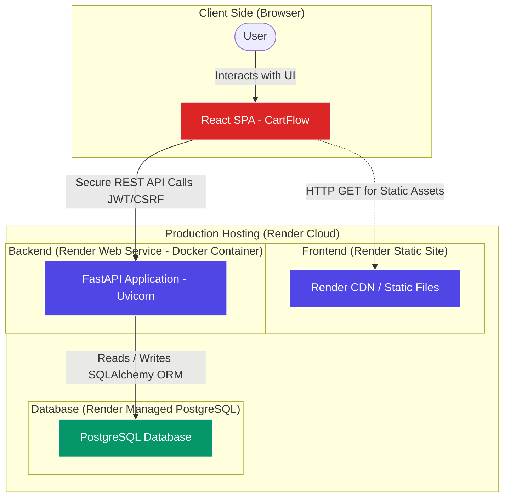
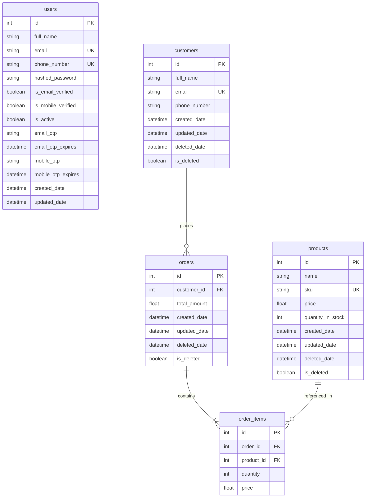

# CartFlow

CartFlow is a modern, fully containerized **Product, Customer, and Order Management System** built with a FastAPI backend and a React/Vite frontend, backed by PostgreSQL.

---

## 🌐 Live Production Links

* **Frontend Web App:** [https://cartflow-1.onrender.com](https://cartflow-1.onrender.com/login)
* **Backend API URL:** [https://cartflow-nqgp.onrender.com](https://cartflow-nqgp.onrender.com/)
* **Backend Docker Image (Docker Hub):** [sbhakti919/cartflow-backend](https://hub.docker.com/r/sbhakti919/cartflow-backend/tags)

---

## 🚀 Key Features

* **Secure Authentication:** JWT-based user authentication paired with CSRF token protection.
* **Product Catalog:** Manage catalog inventories with complete CRUD operations.
* **Customer Directory:** Directory listing for client profiles and purchase history.
* **Orders Pipeline:** Manage client purchasing workflows and order receipts.
* **Rate Limiting:** SlowAPI protection on critical authentication endpoints to prevent abuse.
* **Modern Interface:** Premium glassmorphic styling, dark modes, and fluid UI interactions.
* **Containerized Orchestration:** Production-ready multi-container architecture using Docker and Docker Compose.

---

## 🛠️ Technology Stack

### Backend (FastAPI)
* **Core:** Python 3.12, FastAPI
* **Database & ORM:** PostgreSQL, SQLAlchemy
* **Security:** PyJWT, Bcrypt, Starlette CSRF middleware
* **Rate Limiting:** SlowAPI
* **Settings:** Pydantic Settings

### Frontend (React)
* **Build System:** Vite
* **Core:** React 19, React Router v7
* **Icons:** Lucide React
* **Styling:** Custom HSL-driven Vanilla CSS

### DevOps & Orchestration
* **Docker:** Multi-stage lightweight builds (`python:3.12-slim`, `node:20-slim`, `nginx:alpine`)
* **WebServer:** Nginx (serving static files and handling client routing)
* **Database Container:** PostgreSQL 16 Alpine

---

## 📐 System Design & Architecture

CartFlow employs a decoupled client-server architecture. The frontend React Single Page Application (SPA) is served as a highly optimized static build, communicating asynchronously via HTTPS with the containerized FastAPI backend. The backend persists data inside a managed relational PostgreSQL database cluster.



---

## 🗄️ Database Schema & Table Structure

The application defines a normalized database schema mapping users, products, customers, and order invoices. Below is the Entity-Relationship (ER) design:



### Table Definitions

#### 1. `users` (System Administrators)
Stores credentials and verification status for administrative access.
* **`id`** (`Integer`, PK): Unique user ID.
* **`full_name`** (`String`): User's display name.
* **`email`** (`String`, Unique): User's email login.
* **`phone_number`** (`String`, Unique): Verified contact number.
* **`hashed_password`** (`String`): Secure bcrypt password hash.
* **`is_email_verified` / `is_mobile_verified`** (`Boolean`): Verifications flags.
* **`email_otp` / `mobile_otp`** (`String`): One-Time Password tokens.
* **`created_date` / `updated_date`** (`DateTime`): Timestamp records.

#### 2. `products` (Inventory Items)
Stores catalog product details and stock metrics.
* **`id`** (`Integer`, PK): Unique product ID.
* **`name`** (`String`): Name of the product.
* **`sku`** (`String`, Unique): Stock Keeping Unit descriptor.
* **`price`** (`Float`): Unit sale price.
* **`quantity_in_stock`** (`Integer`): Quantity currently in stock.
* **`is_deleted`** (`Boolean`): Soft delete flag.

#### 3. `customers` (Client Accounts)
Stores profiles of customers placing orders.
* **`id`** (`Integer`, PK): Unique customer ID.
* **`full_name`** (`String`): Customer's full name.
* **`email`** (`String`, Unique): Customer's email.
* **`phone_number`** (`String`, Nullable): Contact number.
* **`is_deleted`** (`Boolean`): Soft delete flag.

#### 4. `orders` (Purchases)
Represents a transaction header.
* **`id`** (`Integer`, PK): Unique order ID.
* **`customer_id`** (`Integer`, FK -> `customers.id`): Customer who made the purchase.
* **`total_amount`** (`Float`): Aggregated cost of the order.
* **`is_deleted`** (`Boolean`): Soft delete flag.

#### 5. `order_items` (Purchase Itemization)
Tracks products purchased within an order.
* **`id`** (`Integer`, PK): Unique order item ID.
* **`order_id`** (`Integer`, FK -> `orders.id`): Parent order.
* **`product_id`** (`Integer`, FK -> `products.id`): Product purchased.
* **`quantity`** (`Integer`): Units purchased.
* **`price`** (`Float`): Unit price at the time of purchase.

---

## 📁 Repository Structure

```text
├── backend/
│   ├── app/                 # FastAPI code (models, controllers, database, settings)
│   ├── Dockerfile           # Backend container setup (runs as non-root appuser)
│   ├── requirements.txt     # Python dependencies
│   └── .dockerignore
├── frontend/
│   ├── src/                 # React code (views, context, services)
│   ├── Dockerfile           # Multi-stage container setup (Node build + Nginx serve)
│   ├── nginx.conf           # SPA fallback routing configuration
│   ├── package.json
│   └── .dockerignore
├── docker-compose.yml       # Multi-container orchestration (db + backend + frontend)
├── .env.example             # Template for local environment variables
└── README.md                # Project documentation
```

---

## 💻 Local Setup (With Docker - Recommended)

### Prerequisites
Make sure you have [Docker Desktop](https://www.docker.com/products/docker-desktop/) installed and running on your system.

### 1. Configure the Environment
Copy `.env.example` at the root directory to create your local `.env` file:
```bash
cp .env.example .env
```
*(Open `.env` and verify your credentials. The default values work out of the box).*

### 2. Launch the Services
Spin up the database, backend API, and frontend web server in detached mode:
```bash
docker compose up -d
```

### 3. Access the Application
* **Frontend Web Portal:** [http://localhost:3000](http://localhost:3000)
* **Backend API Docs (Swagger):** [http://localhost:8000/docs](http://localhost:8000/docs)
* **Backend API Root:** [http://localhost:8000](http://localhost:8000)

---

## 🛠️ Local Setup (Manual - Without Docker)

### 1. Backend Setup
1. Navigate to the `backend/` directory:
   ```bash
   cd backend
   ```
2. Create and activate a Python virtual environment:
   ```bash
   python -m venv venv
   # On Windows:
   .\venv\Scripts\activate
   # On macOS/Linux:
   source venv/bin/activate
   ```
3. Install the dependencies:
   ```bash
   pip install -r requirements.txt
   ```
4. Create a `.env` file inside the `backend/` folder and add your local PostgreSQL configuration:
   ```env
   DATABASE_URL=postgresql://<username>:<password>@localhost:5432/product_db
   CORS_ALLOWED_ORIGINS=http://localhost:5173,http://localhost:3000
   JWT_SECRET_KEY=yoursecretkeyhere
   ```
5. Run the FastAPI development server:
   ```bash
   uvicorn app.main:app --reload --port 8000
   ```

### 2. Frontend Setup
1. Navigate to the `frontend/` directory:
   ```bash
   cd ../frontend
   ```
2. Install npm packages:
   ```bash
   npm install
   ```
3. Create a `.env` file inside the `frontend/` folder:
   ```env
   VITE_API_BASE_URL=http://localhost:8000
   ```
4. Run the Vite development server:
   ```bash
   npm run dev
   ```
   *(Frontend will launch on [http://localhost:5173](http://localhost:5173))*

---

## ⚙️ Environment Variables Reference

| Variable | Scope | Description |
| :--- | :--- | :--- |
| `DATABASE_URL` | Backend | Connection string to the PostgreSQL database. |
| `JWT_SECRET_KEY` | Backend | Secret string to sign JWT security tokens. |
| `JWT_ALGORITHM` | Backend | Encryption algorithm (defaults to `HS256`). |
| `ACCESS_TOKEN_EXPIRE_MINUTES` | Backend | Expiry window for login tokens (defaults to `30`). |
| `CORS_ALLOWED_ORIGINS` | Backend | Comma-separated list of origins permitted to access the API. |
| `VITE_API_BASE_URL` | Frontend | Target API domain of the backend service. |
